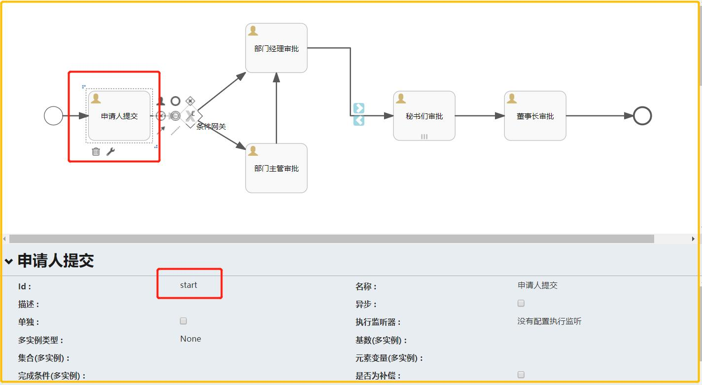
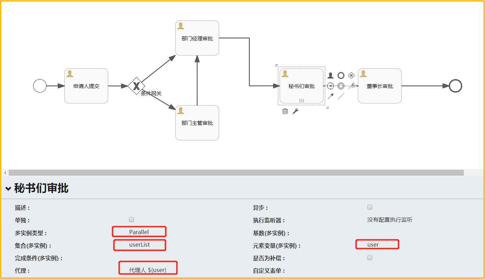
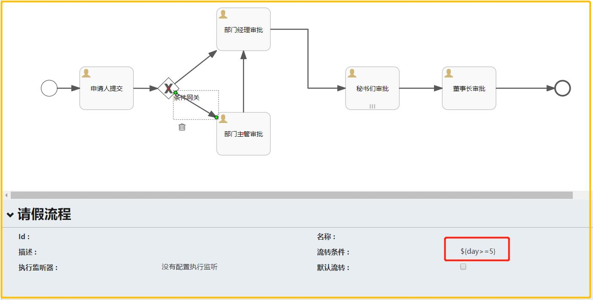

# GDC Oracle PSSA平台 V1.0                        
## 1，平台介绍
**基于springcloud微服务架构的pass平台**
### 1.1，技术栈 
- **springcloud**
   - eureka
   - config
   - springcloud bus
   - hystrix
   - feign
   - zuul
   - zipkin
- **mybatis** 
- **swagger**
- **flyaway**  

     
## 2，开发环境
### 2.1, 配置nexus私服
找到IED依赖的Maven的setting文件，修改2个地方
   
1. 在servers标签中增加server   
```      
    <server>
       <id>cams-nexus</id>
       <username>admin</username>
       <password>admin123</password>
    </server>
```   
2. 在mirrors标签中增加mirror
```     
    <mirror>
      <id>cams-nexus</id>
      <mirrorOf>*</mirrorOf>
      <url>http://124.17.100.180:8081/repository/maven-public/</url>
    </mirror>
```    
### 2.2, 安装lombok插件
该平台的所有实体对象都使用lombok简化代码，所以需要安装lombok插件后，编译才能不报错

## 3，开发指南
项目中的demo-services为示例代码，可以快速帮大家熟悉框架的使用

### 3.1，平台目录结构

```
├── config                            --配置文件统一管理文件夹
│   ├── dev                           --开发环境配置
│   │   ├── config-common.yml         --通用配置
│   │   └── config-bpm.yml            --流程引擎配置
│   │   └── config-file.yml           --文件服务配置
│   │   └── config-XXXX.yml           --XXX服务配置
│   ├── test                          --测试环境配置 
│   └── prod                          --生产环境配置
├── doc                               --文档管理文件夹
│   ├── data                          --DDL,DML文件夹
│   ├── 需求                           --需求文档
│   └── readme.md                     --平台介绍
├── platform-api                      --api接口项目
│   └── pom.xml                       
├── platform-common                   --平台通用类库
│   ├── core                          --核心类库
│   └── pom.xml                       
├── platform-support                  --平台支撑类服务
│   ├── config-server                 --配置中心
│   ├── eureka-server                 --注册中心
│   └── pom.xml                         
├── services-basic                    --平台基础类服务（paas）
│   ├── bpm-service                   --流程引擎服务
│   ├── file-servic                   --文件服务
│   ├── isump-service                 -- 4A服务 
│   └── pom.xml                       
├── services-business                 --业务服务项目
│   ├── demo-services                 --demo服务集合
│   ├── fssc-servic                   --财务服务 
│   ├── portal-service                --门户服务
│   ├── srpmp-service                 --科研服务
│   └── pom.xml                       
└── pom.xml                           

```
### 3.2，主要依赖

- ***platform.pom***
   - spring-boot-starter-test     
   - spring-cloud-starter-netflix-eureka-client
   - spring-cloud-starter-config
   - lombok
   - springfox-swagger2
   - springfox-swagger-ui
   - spring-boot-devtools
     
- ***platform-api.pom***
   - spring-cloud-starter-contract-stub-runner 微服务契约测试套件
   - spring-boot-starter-data-rest  HAL风格的Restful应用
   - spring-data-rest-hal-browser   HAL风格的Restful应用测试
   
- ***platform-common.pom***


### 3.3，servers-business 业务目录结构

```
    api接口
    com.deloitte.platform.api.业务服务.
                              .feign   feign客户端
                              .param   请求参数  
                              .vo      返回VO
                              .client  控制层接口 
    业务服务
    com.deloitte.services.业务服务.
                              .controller   控制层实现
                              .entity       实体对象
                              .mapper       映射对象 
                              .service      服务
                              .util         工具类（内置代码生成类）
                              .exception    错误异常定义
                  
```
                          
### 3.4，自动代码生成
项目的Util包内有XXXCodeGenerator的类，会自动生成全套的CURD方法和接口
```
/**
 * @Author : jackliu
 * @Date : Create in 16:56 28/01/2019
 * @Description :
 * @Modified :
 */
public class FileCodeGenerator {

    public static void main(String[] args) {
        //代码生成器属性
        GeneratorCodePropertis gcp=new GeneratorCodePropertis();
        //数据库驱动
        gcp.setDriverName("oracle.jdbc.OracleDriver");
        //数据库连接URL
        gcp.setUrl("jdbc:oracle:thin:@124.17.100.184:1521:TEST");
        //数据库用户名
        gcp.setUsername("bpm");
        //数据库密码
        gcp.setPassword("bpm");
        //需要生成通用代码的表名
        gcp.setTableNames(new String[] { "FILE_INFO"});
        // 项目文件生成后存放的绝对路径
        gcp.setBaseProjectPath("C:\\workspace\\cams\\code\\trunk-cams\\cams-back\\platform\\services-basic\\file-service");
        // 接口文件生成后存放的绝对路径
        gcp.setApiProjectPath("C:\\workspace\\cams\\code\\trunk-cams\\cams-back\\platform\\platform-api");
        // 服务名称
        gcp.setModuleName("fileservice");
        // 服务的包名（默认的包名是：com.deloitte.services ，如果是业务服务，使用默认值就可以了）
        gcp.setPackageMsg("com.deloitte.platform.basic");
        // 生成代码的作者
        gcp.setAuthor("jackliu");
         // 是否只生成数据库实体（true:只会生成entity和派生出来的VO，FORM对象。 false:除了POJO之外，还会生成相应的Controller，service和基本的CURD操作）
        gcp.setOnlyGeneratorPOJO(false);        
        // 是否支持微服务间的调用（true:会生成feign客户端以及相应的fallback函数）
        gcp.setGeneratorSpringCloud(true);

        CodeGenerator.generatorCode(gcp);
    }
}

```    

### 3.5，统一的异常处理

1.项目使用了统一的异常处理，异常继承规范如下
```
                 RuntimeException
                       |
                  BasicException
             |---------|----------|   
    PlatformException         ServiceException      
```          
+ BasicException: 自定义异常基类
+ PlatFormException: 平台类异常
+ ServiceException： 业务服务异常

2.各个服务需要自己定义自己的业务错误码，错误码的继承规范如下
```
                      IErrorType
                         |
        |----------- |-----------|---------|                 
 FileErrorType   BpmErrorType   ...serverErrorType                   
```        
+ IErrorType          错误码接口
+ FileErrorType       文件服务错误码
+ BpmErrorType        流程引擎错误码
+ ...ServerErrorType  某某服务错误码

**错误码的编码规则：服务端口号+4位流水**   

3.项目中的异常处理

a：直接抛出ServiceException:例如没有找到文件，直接抛出文件未找到异常
```
        FileInfo filesInfo = fileInfoService.getById(fileInfoId);
        if(filesInfo==null){
            throw new ServiceException(FileErrorType.FILE_NOT_EXSIT);
        }
```   
b: catch住别的异常后抛出ServiceException。一定不要吞掉别的异常错误信息，不然后面没办法排查问题
 (e.getMessage()如果还不能帮助定位问题，就需要e.getCause()) 
```
         catch (IOException e) {
              throw new ServiceException(FileErrorType.FILE_READ_ERROR, e.getMessage());
         }
     or
         catch (IOException e) {
              throw new ServiceException(FileErrorType.FILE_READ_ERROR, e.getMessage(),e.getCause());
         }             
```        
*这些异常不用捕获，controller层都不需要捕获*

### 3.6，统一的rest返回对象
  所有Rest风格的请求都返回com.deloitte.platform.common.core.entity.vo.Result对象，对象支持泛型。
  如果返回的有实体对象，请使用带泛型的Result,更容易反序列化，在swagger中也能看到返回值的示例。
  如果用feign返回分页数据的时候，不要用返回Ipage，会有反序列化的问题，请使用GdcPage。  
  
### 3.7， POJO介绍
  平台主要内置了4种POJO
+ PO(Persistant Object) 持久对象：与数据库的表对应。存放在各个service的Entity包下
+ VO(view Object) 表现对象: 返回给页面或者外围系统的数据的集合。
+ Form(from Object)表单对象：主要用于保存或者修改时提交的Form对象，可以增加校验规则，例如新增用户时，用户名必须填写
+ QueryForm(query object)查询对象：构造查询条件是提交的Form对象，可以增加校验规则，例如查询截止时间必须晚于开始时间
 
这几类POJO，PO存放在服务内部，不对外暴露，VO，Form，QueryForm放在API中，提供给外部服务使用。 
这几类POJI还存在各种转换关系，例如 Form转换成PO， PO转换成VO，平台的BeanUtils提供了相应的转换方法。
VO中的Long型ID返回给前端时，可能会存在精度丢失的问题，可以将VO中的ID改成String来解决问题。

### 3.8，事务控制
+ ServiceImpl类的方法上不要throws异常，不然默认的事务控制不会回滚，如果调用其他的方法有异常，那就用catch后抛出ServiceException
参考3.5：3：b的情况
+ 

### 3.9，包名规则(包名前缀)
+ api : com.deloitte.platform.api 
+ common: com.deloitte.platform.common
+ support: com.deloitte.platform.support
+ basic: com.deloitte.platform.basic
+ business：com.deloitte.services

**请严格按照包名规则建类，框架的很多配置都是基于该目录结构做的，不遵守的话可能会导致启动失败**
### 3.10，端口规则
+ 支撑服务端口段  81XX

+ 基础服务端口段  82XX

+ 业务服务端口段  84XX

+ 测试服务端口段  89XX


## 4，数据库规范（Oracle数据库）
 
### 4.1 建表规则
1. 表名
2. 字段
   1. 通用字段  
       - id           number(20)
       - create_time  timestamp
       - carete_by    vachar2
       - update_time  timestap
       - update_by    varchar2    
   2. 扩展字段  
       - EXT1  varchar2(255)  
       - 。。。。  
       - EXT5  varchar2(255)
   3. 数据权限维度字段  
       - org_id      number(20)   
       - org_path    varchar2(255)    e.g  a,b,c,d 
 

### 4.2 SQL规范

## 5，基础服务介绍（PASS）

### 5.1 文件服务
- ***文件服务的主要功能， 具体功能请参考swagger***
   - 单文件上传
   - 批量文件上传
   - 文件下载
   - 文件断点续下(构建中)
   - 文件分片上传(构建中)
   

### 5.2 流程引擎服务
- ***绘制流程的页面入口在：http://localhost:8202/***
   - 绘制流程图时，第一个节点必须命名为start节点并标识为提交节点。 撤回或者或者驳回到该节点后，请使用流程审批功能   
   
   - 流程中的会签功能使用多实例usertask实现，多实例类型，集合，代理等参数请务必按照下面的图片填写
   
   - 如果想根据不同的条件选择不同的流程分支，请在每个分支上写上满足的条件，并在流程参数中带上该条件
      
     
- ***流程实现的功能， 具体功能请参考swagger和service里的doc文档***
   - 流程提交
   - 流程审批
   - 流程撤回（指定人撤回或者是发起人撤回，发起人撤回后请走流程审批，不要调用流程提交）
   - 流程驳回（审批人驳回给指定人或者是发起人，驳回到发起人后，发起人请走流程审批，不要调用流程提交）
   - 流程拒绝（直接结束流程） 
   
- ***审批矩阵的功能***
   - 查找下一节点的审批人列表 （如果是提交人查找下一节点，请使用start参数）
     
- ***审批矩阵的功能***
   - 查找下一节点的审批人列表 （如果是提交人查找下一节点，请使用start参数，如果是通过撤回或者驳回到发起人的，可以通过start,也可以通过taskid）
   - 最后一个环节找下一节点的审批人时，返回的是空。

- ***待办已办功能***  
   - 查询待办
   - 查询已办
    
       
### 5.3 4A服务


## 有问题反馈
   平台还在构建中，在开发过程有任何问题或者好的建议都可以联系我，让我们一起来完善这个平台   [@jackliu](jackliu@deloitte.com.cn)


